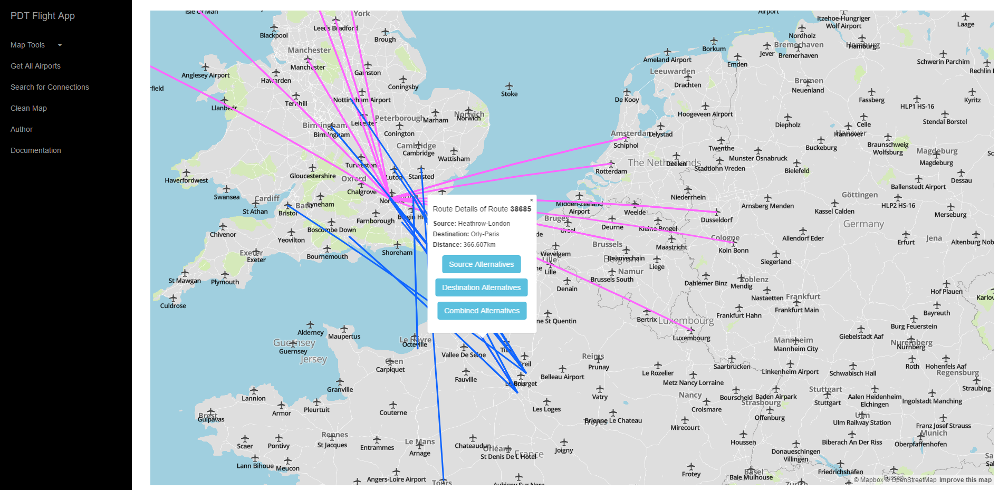

# Overview
Application is designed as simple lightweight application implemented in nodejs/jquery programming languages with following set of features:
- Visualisation of all available airports
- Search routes between those airports
- Displaying routes from specific airport based on distance
- Alternative route search in proximity of 200km or source or destination airport

Application is designed with following interface:


The application has 2 separate parts, the client which is a [frontend web application](#frontend) using mapbox API and mapbox.js and the [backend application](#backend) written in [Express NodeJs](expressjs.com), backed by PostGIS. The frontend application communicates with backend using a [REST API](#api).

# Frontend

The frontend application is designed as single-page application with document root (/) as only page. Main view of application shows simple option menu on the left side of web page and map implemented with mapbox.js widget. Mapbox widget is added to web page as basic v9 style. Because of the simplicity of web page, no special styles were required.
Frontend code is separated in following files:
- index.ejs file: Embedded javascript file with mostly static content. It also contains some simple javascripts with button bindings, map init bindings and references to bootstrap stylesheets, custom and external javascript files.
- map_init.js: File responsible for initializing map widget.
- db_api_accessor.js: Main javascript frontend file. Responsible for sending GET request to backend part of the application, creating and managing map layers.
- some other less important files like modals.html, which contains some modal html content later included in main index.ejs, custom stylesheet style.css etc.

# Backend
Backend application is written in NodeJs programming language with usage of Express framework. Following files are main components of the backend part of the application.
- /bin/www & app.js: Logic contains webserver configuration, definition of error pages and some other express configuration. Server is by default running on port 3000. In case you are running this application on local machine, use localhost:3000 to access this application.
- package.json: Json file containing required dependencies. Command npm install can be used to install required dependency packages and libraries into local system.
- database_api.js: Custom javascript file used for initialization of database connection, execution of SQL logic, generation http backend responses and serialization of SQL results into Json structures.
- index.js. File responsible for creation of http api routes. File is also managing http api requests into proper nodejs function implemented in database_api.js

## Data
All data used for this application comes from [OpenFlights](http://openflights.org/data.html) webpage. Data were stored by default in csv format, command external converters into geojson were used to add those data into custom postgis database in desired format.
Following data structures were created:
Airports - data and point geometry of airports.
- airport_id: Airport identifier
- wkb_geometry: Gis data of airport
- name: Name of the airport.
- country: Country or territory where airport is located.
- iata: 3-letter FAA code, for airports located in Country "United States of America". 3-letter IATA code, for all other airports. Blank if not assigned.
- icao: 4-letter ICAO code. Blank if not assigned.
- timezone: Hours offset from UTC. Fractional hours are expressed as decimals, eg. India is 5.5.
- dst: Daylight savings time. One of E (Europe), A (US/Canada), S (South America), O (Australia), Z (New Zealand), N (None) or U (Unknown).
- tzdb: Database time zone. Timezone in "tz" (Olson) format, eg. "America/Los_Angeles".

Routes - lines of routes between airports
- id: Route identifier number.
- wkb_geometry: Geometry linestring of route
- source_aiport: Source airport code.
- source_airport_id: Source airport identifier
- destination_airport: Destination airport code.
- destination_airport_id: Destination airport identifier.
- codeshare: "Y" if this flight is a codeshare (that is, not operated by Airline, but another carrier), empty otherwise.
- stops: Number of stops on this flight ("0" for direct)
- equipment: 3-letter codes for plane type(s) generally used on this flight, separated by spaces

## Api

Following backend api calls are implemented. All api calls are GET requests.

List of all airports:
/api/airports

Get specific airport details:
/api/airports/:airport_id

Get routes from specific airport based on distance:
/api/airports/:airport_id/routes/dist=:distance

Get specific route details:
/api/routes/:route_id

Get alternative routes of specific route. Alternative type can be source,destination or combined:
/api/routes/:route_id/alternatives/type=:alternativeType

Get all available countries with airports:
/api/countries

Get airports located in specific coutnry:
/api/countries/:country

Search for routes from specific source airport to specific destination airport:
/api/routes/:source/:destination


### Response

API calls returns json responses with response status, response message and data processed from postgis database. Standard SQL columns are saved in json as standard strings or integers, gis data are obtained in geojson format.
Following json is example of api response:
```
{
   "status":"success",
   "data":{
      "id":22,
      "name":"Winnipeg St Andrews",
      "city":"Winnipeg",
      "timezone":-6,
      "tzdb":"America/Winnipeg",
      "iata":"YAV",
      "st_asgeojson":"{"type":"Point","coordinates":[-97.0325,50.056389,760]}"
   },
   "message":"Query successfully processed"
}
```
